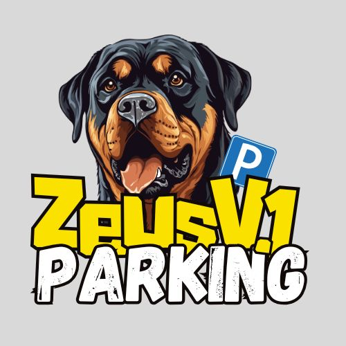

# ZeusParking - Sistema de Gestión de Parqueadero Universitario Uniminuto - Sede Soacha

 

## Descripción del Proyecto

ZeusParking es una aplicación móvil desarrollada como proyecto académico para la gestión inteligente de parqueaderos en campus universitarios. La solución permite:

- Registro y autenticación segura de usuarios (estudiantes, personal administrativo y vigilantes)
- Control de acceso vehicular mediante tecnología QR
- Visualización en tiempo real de disponibilidad de espacios
- Notificaciones proactivas sobre capacidad del parqueadero
- Integración con Google Maps para ubicación de sedes

El sistema está diseñado para optimizar el flujo vehicular en las instalaciones de la universidad, reduciendo tiempos de espera y mejorando la seguridad.

## Características Principales

### Módulo de Usuario
- 🔐 Autenticación con correo electrónico (verificación por link) o cuenta Google
- 📝 Registro de vehículos (bicicletas, motos, carros, furgones)
- 🖼️ Almacenamiento de fotos del usuario y del vehículo
- 🏷️ Generación de QR único con datos del vehículo
- 📊 Visualización de espacios disponibles por tipo de vehículo
- 📌 Geolocalización de sedes universitarias

### Módulo de Vigilante
- 📷 Escáner QR para registrar entradas/salidas
- 👤 Validación visual de fotos del usuario y vehículo
- 🔄 Actualización en tiempo real de disponibilidad
- ⚠️ Notificaciones cuando los espacios están por agotarse

## Instrucciones de Instalación

1. **Requisitos previos:**
   - Android Studio Flamingo o superior
   - Dispositivo físico o emulador con Android 8.0 (Oreo) mínimo
   - Conexión a Internet para configuración inicial

2. **Pasos para ejecutar el proyecto:**
   ```bash
   git clone https://github.com/ByTENITO/ZeusParking
   cd ZeusParking
   Abrir en Android Studio y sincronizar Gradle
   Ejecutar en dispositivo/emulador

3. **Configuracion de Firebase**
   ```bash
    Añade tu archivo google-services.json en app/build.gradle.kt:projects/plugins
    Habilita Authentication (Email/Google) y Firestore en Firebase Console autentication/keys/uso/configuración
 
## Uso de la Aplicación

   ### Flujo Principal

   1. Autenticación (**AuthActivity.ky**)
      
      - Registro con email y contraseña (incluye verificación)
      - Inicio de sesión con Google
      - Validación de credenciales con mensajes descriptivos
     
   2. Regristro de Vehiculo (**RegistrarBiciActivity.kt**)
      
      - Formulario con datos personales y del vehículo
      - Captura de fotos del usuario y placa/marco
      - Selección de tipo de vehículo (Spinner adaptativo)
     
   3. Generacion de QR (**QrActivity.kt**)
      
      - Visualización del código QR con datos cifrados
      - Animaciones de transición suaves
      - Visualización cada vez que se ingresa a la actividad
      - Un qr unico por usuario  
        
   4. Control de Acceso (**EntradaQrParqueadero / SalidaQrParqueadero**)
      
      - Escaneo QR con cámara en tiempo real
      - Validación contra base de datos Firestore
      - Actualización automática de disponibilidad (**DatosUsuarioEntrada.kt / DatosUsuarioSalida.kt**)

   5. Visualización de Datos (**HomeActivity.kt / Home_vigilante.kt**)

      - Dashboard con espacios disponibles, segun tipo de vehiculo registrado
      - Notificaciones push cuando la capacidad es crítica, segun el tipo de vehiculo registrado
     
 ## Estructura de Código

 ### Clases y Funcionalidades

| Clase                          | Función                                                                 |
|-------------------------------|-------------------------------------------------------------------------|
| `AuthActivity`                | Gestiona autenticación con Firebase (Email/Google)                     |
| `BaseNavigationActivity`      | Clase base para navegación entre fragments                             |
| `DatosUsuarioEntrada/Salida`  | Procesa registro de entradas/salidas y actualiza Firestore             |
| `Entrada/SalidaQrParqueadero` | Implementa escáner QR con ML Kit                                       |
| `Home_vigilante`              | Dashboard para vigilantes con monitoreo en tiempo real                 |
| `Localizacion`                | Integración con Google Maps para ubicación de sedes                    |
| `QrActivity`                  | Generación y visualización de códigos QR                               |
| `RegistrarBiciActivity`       | Formulario de registro de vehículos con almacenamiento en Firebase Storage |


   ## Tecnologias Utilizadas

   - **Lenguaje:** Kotlin 100%
   - **Arquitectura:** MVVM (Modelo-Vista-VistaModelo)
   - **Base de Datos:** Firebase Firestore (NoSQL)
   - **Autenticación:** Firebase Auth (Email/Google)
   - **Almacenamiento:** Firebase Storage para imagenes
   - **Scanner QR:** ML Kit Barcode Scanning
   - **Mapas:** Google Maps SDK
   - **Notificaciones:** NotificationManager con canales
   - **Dependencias principales:**

     ```bash
     implementation 'com.google.firebase:firebase-firestore-ktx:24.7.0'
      implementation 'com.google.mlkit:barcode-scanning:17.2.0'
      implementation 'com.squareup.picasso:picasso:2.8'

  ## Requisitos del Sistema

   1. **Sistema operativo:** Android 8.0 + (Api 26)
   2. **Permisos requeridos:**
        - Camara (Para esaner QR)
        - Ubicación (para geolocalización)
        - Almacenamiento (para fotos de perfil)
   3. **Dependencias externas:** Servicios de Google Play


